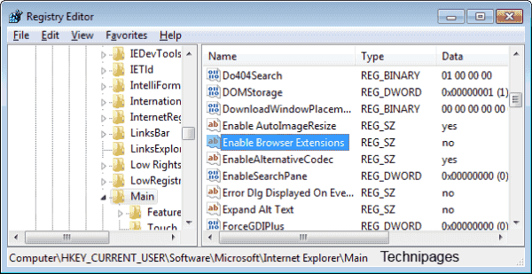

# Informe de Regedit en Windows 10 sobre Anomalía en Internet Explorer

FECHA: 24 DE JULIO 2024

ANALISTA: CARLOS MUÑOZ

## INTRODUCCION

En este informe se documentara el proceso realizado en un sistema operativo windows 10, en la ubicacion de registros (regedit)

## CONTENIDO

se ingreso a regedit a la localizacion 

Configuraciones Generales de Internet Explorer Ruta del Registro: HKEY_LOCAL_MACHINE\SOFTWARE\Microsoft\Internet Explorer 

Configuraciones de Seguridad Ruta del Registro: HKEY_LOCAL_MACHINE\SOFTWARE\Microsoft\Windows\CurrentVersion\Internet

Configuraciones de Zonificación Ruta del Registro: HKEY_CURRENT_USER\Software\Microsoft\Windows\CurrentVersion\Internet Settings\Zones

y se observo una anomalia en las ubicaciones, que solo obervando se ve un poco extraño o manipulado

<p align="center">

</p>

## CONCLUSION
Se realizaran pruebas y sanitizacion exhaustiva a traves de herramientas de antivirus y antimalware,ya que esto puede provocar un mal funcionamiento en el sistema informatico que se realizo la mantencion preventiva de software


## Diagrama de Flujo del Proceso

```mermaid
graph TD
    A[Detectar Anomalía en IE] --> B[Abrir regedit]
    B --> C[Navegar a Clave Relevante]
    C --> D{¿Anomalías Encontradas?}
    D -- Sí --> E[Documentar y Guardar]
    E --> F[Informar Soporte Técnico]
    F --> G[Cerrar regedit]
    G --> A
    D -- No --> H[Diagnóstico Alternativo]
    H --> A

    style A fill:#FFA500,stroke:#000,stroke-width:2px,color:#000
    style B fill:#FFA500,stroke:#000,stroke-width:2px,color:#000
    style C fill:#FFA500,stroke:#000,stroke-width:2px,color:#000
    style D fill:#FFA500,stroke:#000,stroke-width:2px,color:#000
    style E fill:#FFA500,stroke:#000,stroke-width:2px,color:#000
    style F fill:#FFA500,stroke:#000,stroke-width:2px,color:#000
    style G fill:#FFA500,stroke:#000,stroke-width:2px,color:#000
    style H fill:#FFA500,stroke:#000,stroke-width:2px,color:#000


