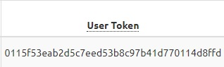

# Informe de implementador

Nombre: Carlos Muñoz

Rol: Implementador

Curso: Redes seguras y Ciberseguridad

Nombre proyecto: Home Easy

Fecha de entrega: 5-8-2024

# Introducción
Crear una pagina web segura es esencial , para proteger tu negocio y también para entregar un buen servicio y que les de seguridad a los clientes que sus datos están protegidos ya que esto dará una buena reputación a tu negocio y o empresa, con esto se puede disminuir los posibles ciberataques hacia tu aplicación web

# Configuración de sistemas de control de acceso y cifrado de datos

Se hizo configuración de acceso para administrador, el cual tendrá acceso total a todas las páginas y podrá eliminar, modificar y agregar datos si fuera necesario

Por otro lado, se hizo un perfil para usuarios(clientes) en el cual solo se mostrarán las páginas necesarias para su uso, las cuales serían las páginas cotizaciones y contacto}

En cuanto al cifrado de datos se utilizó la encriptación para contraseñas SHA256, no es la tecnología mas actual pero hoy en día se sigue utilizando y entrega seguridad para la protección de los datos, en el ejemplo actual la contraseña es “123” y entrega en el formulario la contraseña encriptada 

Y un user token para verificar la identidad del usuario

# Validaciones de entrada

En esta parte de la aplicación se hicieron validaciones en el formulario de registro , se verifico que un mismo “username” (nombre de usuario) no se pueda utilizar por 2 personas 

También se realizó la validación de e-mail que tenga un formato coherente y no se pueda ingresar el mismo si ya está en uso

Además, se están haciendo validaciones dentro de los formularios de cada página por ejemplo que el campo teléfono sean solo números, el email tenga el formato correcto, que un usurario al estar más de 5 minutos inactivo lo expulse

# Conclusión

Aun estamos trabajando en esta aplicación, sin embargo, es importante destacar que la seguridad es un proceso continuo y que si es necesario realizar las actualizaciones y mejoras de forma periódicas para mantener de aplicación segura de posibles amenazas
